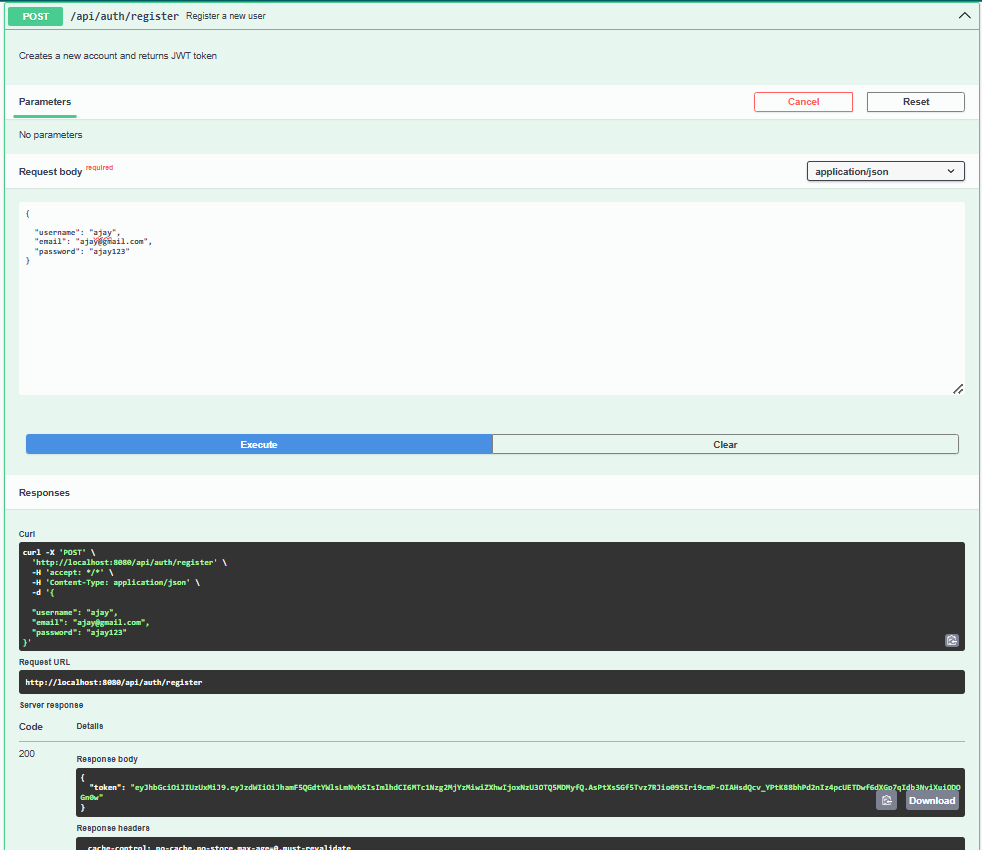
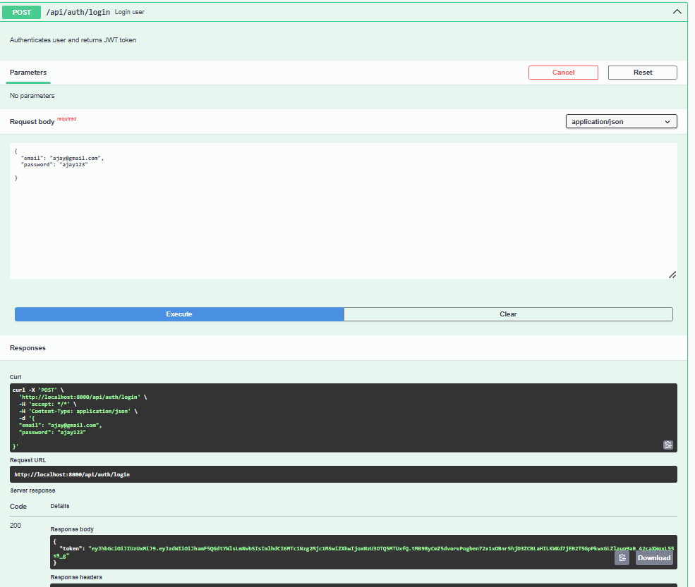
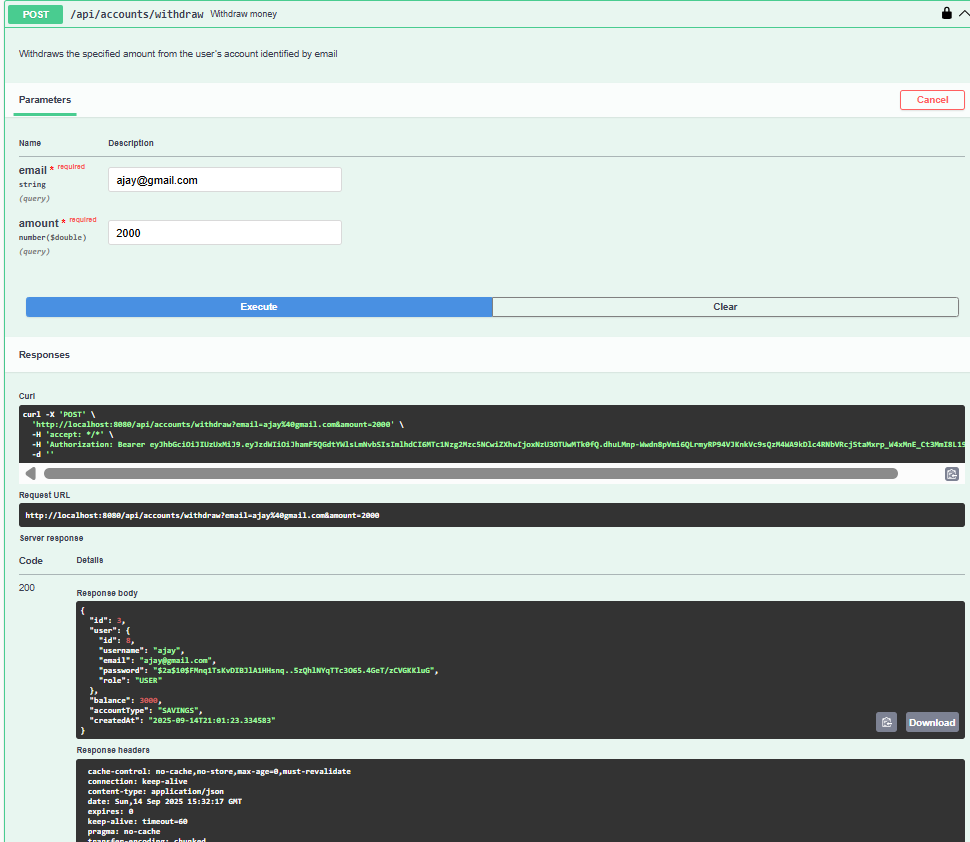

# Banking ATM System

A simple **Banking ATM System** implemented in **Spring Boot**, following a **microservices approach**.  
This project allows user registration, login, account operations (balance check, deposit, withdrawal, fund transfer), and transaction history.

---

## 🔗 Project Links

- API Docs (Swagger UI): `http://localhost:8080/swagger-ui.html`  
- OpenAPI Spec (JSON): `http://localhost:8080/v3/api-docs`  

---

## 🛠 Technology Stack

- **Backend:** Java, Spring Boot, Spring Security, JWT  
- **Database:** H2 / MySQL  
- **API Documentation:** Swagger / OpenAPI 3 (springdoc-openapi)  

---

## 📦 Features

1. User Registration & Login with JWT authentication  
2. Create and manage accounts  
3. Deposit and withdraw money  
4. Transfer money between accounts  
5. View account balance  
6. Transaction history  

---

## 📖 API Documentation

### Authentication APIs

| Endpoint           | Method | Description                         | Request Body                                  | Response                |
|-------------------|--------|-------------------------------------|-----------------------------------------------|-------------------------|
| `/api/auth/register` | POST   | Register a new user                 | `{ "email": "user@example.com", "password": "123", "username": "user1" }` | `{ "token": "<JWT>" }` |
| `/api/auth/login`    | POST   | Login user & get JWT token          | `{ "email": "user@example.com", "password": "123" }` | `{ "token": "<JWT>" }` |
| `/api/auth/test`     | GET    | Health check - API is running      | -                                             | `"API is working!"`     |

---

### Account Management APIs

| Endpoint                    | Method | Description                                   | Request Body / Params                          | Response                  |
|------------------------------|--------|-----------------------------------------------|-----------------------------------------------|---------------------------|
| `/api/accounts/create`       | POST   | Create a new account                          | `email=example@mail.com, balance=1000`       | `Account` object          |
| `/api/accounts/deposit`      | POST   | Deposit money into account                    | `email=example@mail.com, amount=100`         | Updated `Account` object  |
| `/api/accounts/withdraw`     | POST   | Withdraw money from account                   | `email=example@mail.com, amount=50`          | Updated `Account` object  |
| `/api/accounts/balance`      | GET    | Check balance of logged-in user              | JWT in Authorization header                   | `{ "balance": 1000 }`     |
| `/api/accounts/transactions` | GET    | Get transaction history for a user           | `email=example@mail.com`                      | `List<Transaction>`       |
| `/api/accounts/transfer`     | POST   | Transfer money between accounts              | `fromEmail=from@mail.com, toEmail=to@mail.com, amount=100` | `true/false`             |

---
## Screenshots

### Authentication



### Account Management



##  How to Run Locally

** Clone the repo:**
```bash
git clone https://github.com/Swagat-190/BankingAtm.git
cd BankingAtm

### Build the project with Maven:
mvn clean install

 ### Run the application:
mvn spring-boot:run

 ### Access Swagger UI:
http://localhost:8080/swagger-ui.html

🔐 JWT Authentication
All /api/accounts/** endpoints require a valid JWT token in the Authorization header:

Authorization: Bearer <JWT_TOKEN>
You can get the JWT by calling /api/auth/login after registering a user.
